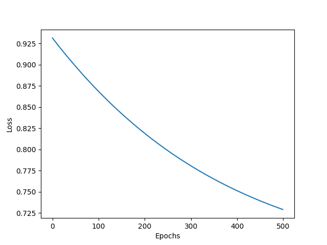

# Heart Attack Prediction

## Dataset

1. Size of dataset = $(m \times n)$
2. $m =$ number of training examples
3. $n =$ number of features
4. $Y =$ binary output indicating heart attack
5. $X =$ feature vector
6. [Dataset From Kaggle](https://www.kaggle.com/datasets/iamsouravbanerjee/heart-attack-prediction-dataset)
   
## Model

1. Non Vectorized implementation of Logistic Regression

## Hyperparameters

| Parameter | Value | Description |
|-----------|-------|-------------|
| $\alpha$  | 0.001  | Learning Rate |
| $epochs$  | 500  | Number of Epochs |

## Parameters

| Parameter | Dimension    | Description |
|-----------|--------------|-------------|
| $W$     | $(1 \times n)$   | Weights |
| $B$       | $(1 \times 1)$   | Bias |

## Loss Function:

$Logistic\space Loss = -\frac{1}{m} \space \sum_{i=1}^{m} \space ( Y^{(i)}\log{\hat{Y}^{(i)}} + (1 - Y^{(i)})\log{(1 - \hat{Y}^{(i)})})$

## Training

1. For $\text{i} \in \{0, 1, \ldots, n - 1\}$:
   1. $Z = W \times X^{T(i)} + B$
   2. $\hat{Y} = \sigma(Z)$
   3. $dW \space += (\hat{Y} - Y^{(i)}) \space \times X^{(i)}$
   4. $dB \space += (\hat{Y} - Y^{(i)})$
2. $dW = dW / \space m$
3. $dB = dB / \space m$
4. $W = W - \alpha \space * dW$
5. $B = B - \alpha \space * dB$

## Learning Curve

## Observations and Results:
1. Accuracy $= 62.8$%
2. Precision $= 37.8$%
3. Feautre Scaling lead to overflow
4. Xavier Initialization of weights drastically reduced accuracy
5. Upon analysis and reading kaggle concluded that this dataset is not genuine and does not reflect the real world.