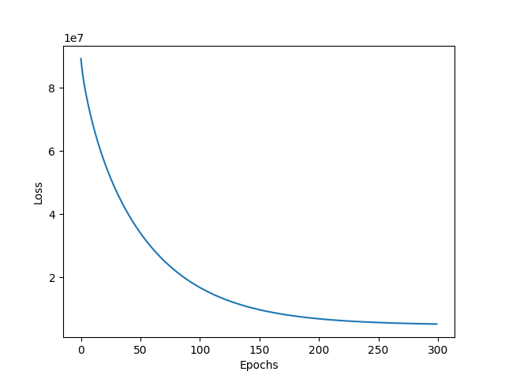
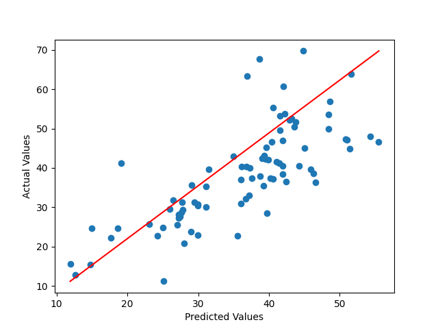

# Real Estate Price Prediction

## Dataset

1. Size of dataset = $( m \times n)$
2. $m =$ number of training examples
3. $n =$ number of features
4. $Y =$ house pirce per unit area
5. $X =$ feature vector
6. [Dataset from Kaggle](https://www.kaggle.com/datasets/quantbruce/real-estate-price-prediction)
   
## Model

1. Non Vectorized implementation of Multiple Polynomial Regression
2. Polynomial degrees used $[3, 3, 1, 3, 4, 3]$

## Hyperparameters

| Parameter | Value | Description |
|-----------|-------|-------------|
| $\alpha$  | 0.01  | Learning Rate |
| $epochs$  | 400   | Number of Epochs |

## Parameters

| Parameter | Dimension    | Description |
|-----------|--------------|-------------|
| $W$     | $(1 \times n)$   | Weights |
| $B$       | $(1 \times 1)$   | Bias |

## Loss Function
$MSE = \frac{1}{m} \sum_{i=1}^{m} (\hat{Y}^{(i)} - Y^{(i)})^2$

## Training
1. For $\text{i} \in \{0, 1, \ldots, n - 1\}$:
   1. $\hat{Y} = W \times X^{T(i)} + B$
   2. $dW \space += (\hat{Y} - Y^{(i)}) \space \times X^{(i)}$
   3. $dB \space += (\hat{Y} - Y^{(i)})$
2. $dW = dW / \space m$
3. $dB = dB / \space m$
4. $W = W - \alpha \space * dW$
5. $B = B - \alpha \space * dB$

## Learning Curve

## Predictions vs Actual Values

## Observations and Results

1. $MAE \space= \space$ 5.78
2. A lot of different degrees and other mathematical functions like $\log X$ were used but ultimately degrees of 3 and 4 worked best
3. Quadratic Scaling increases the $MAE$
4. Reciprocal Scaling increases the loss function
5. During Data Preprocessing Z-Score normalization was found to be better than Min Max Scaling

