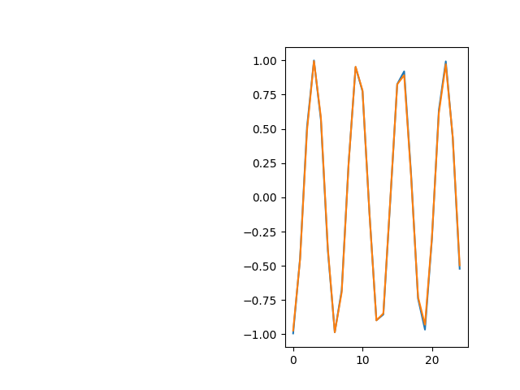

# Sin Wave Regression

## Dataset
1. Sin Wave of size $S$
2. Time Steps of length $T$
3. $X$ tensor of dimension $(S - T \times T \times 1)$
4. $Y$ tensor of dimension $(S - T \times 1)$

## Neural Network Architecture

## Hyperparameters
| Parameter | Value | Description |
|-----------|-------|-------------|
| $\alpha$  | 0.01  | Learning Rate |
| $h$       | 50    | Hidden Units |
| $epochs$  | 50    | Number of Epochs |

## Parameters
| Parameter | Dimension    | Description |
|-----------|--------------|-------------|
| $W_x$     | $(h \times 1)$   | Input Weights |
| $W_h$     | $(h \times h)$   | Hidden Weights |
| $W_y$     | $(h \times 1)$   | Output Weights |
| $B$       | $(h \times 1)$   | Hidden Bias |
| $B_y$     | $(1 \times 1)$   | Output Bias |

## Forward Propagation
1. $X^{(i)<t>}$ refers to $i^{th}$ training example at time step $t$
2. $Z^{<t>} = W_a \times A^{<t - 1>} + W_x \times X^{(i)<t>} + B$
3. $A^{<t>} = \tanh{Z^{<t>}}$
4. $\hat{Y} = W_y^{T} \times A^{<T>} + B_y$

## Loss Function
$MSE: 1/2 \times (\hat{Y} - Y^{(i)})^{2} $ 

## Backward Propagation
1. $dB_y = \hat{Y} - Y^{(i)}$
2. $dW_y = ((\hat{Y} - Y^{(i)}) \times A^{<T>T})^{T}$
3. $dA^{<t>} = (\hat{Y} - Y^{(i)}) \times W_y^{T}$

4. For $\text{t} \in \{\text{n}-1, \text{n}-2, \ldots, 0\}$: 
   1. $dZ^{<t>} = (1 - (A^{<t>})^{2}) * dA^{<t>T}$
   2. $dB \space += dZ^{<t>}$
   3. $dW_x \space += dZ^{<t>} \times X^{<t>}$
   4. $dW_a \space += dZ^{<t>} \times A^{<t-1>T}$
   5. $dA^{<t - 1>} = dZ^{<t>} \times W_a$
   
## Prediction on Test Data

## Implementation Details
1. The network is very sensitive to weight initialization
2. Gradient Clipping is used to counter exploding gradients problem
3. A Deep version of this network was also implemented available in this repository