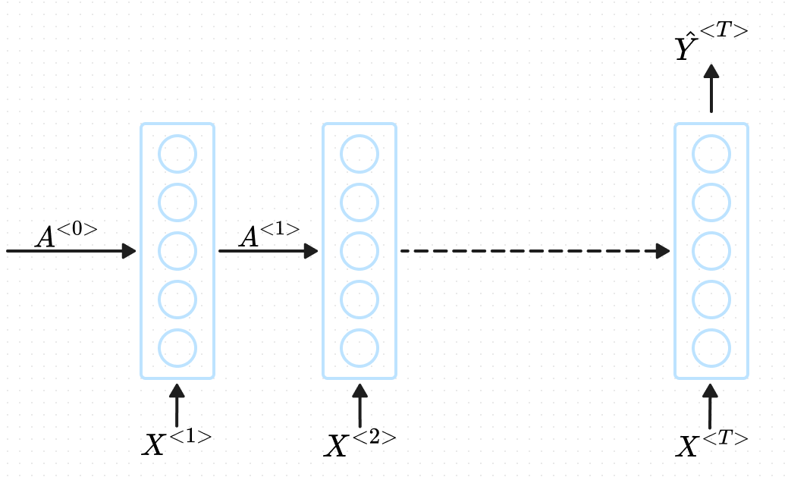

## Sin Wave Regression

### Dataset
Sin Wave of size $S$
Time Steps of length $T$
$X$ tensor of dimensions $(S - T \times T \times 1)$
$Y$ tensor of dimensions $(S - T \times 1)$

### Neural Network Architecture

